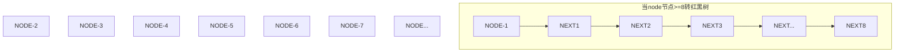

## hashMap源码分析

### put

- table 默认长度为16 
- 负载因子为0.75 
- 扩容 当 put 时 所占table个数达到12 就会开始扩容 扩容为倍数 也就是16*2
- 当table中,某一node 节点 hash碰撞的次数(也就是链表的次数>=8) 就会将此节点转化为红黑树 前提(table个数要>=64)
- 
<!-- more -->
```java
    public V put(K var1, V var2) {
        //此处 hash(var1) 对key进行hash取模运算
        return this.putVal(hash(var1), var1, var2, false, true);
    }

	static final int hash(Object var0) {
        int var1;
        //对应上
        return var0 == null ? 0 : (var1 = var0.hashCode()) ^ var1 >>> 16;
    }

	//var1 hash运算后的值 	key = var2,value = var3
    final V putVal(int var1, K var2, V var3, boolean var4, boolean var5) {
        HashMap.Node[] var6;
        int var8;
        if ((var6 = this.table) == null || (var8 = var6.length) == 0) {
            //首次put进入 this.resize() 获取 table 长度
            var8 = (var6 = this.resize()).length;
        }
        Object var7;
        int var9;
        //1.多次put 先取值
        if ((var7 = var6[var9 = var8 - 1 & var1]) == null) {
            //首次put将 值放入到数组的最后一位
            var6[var9] = this.newNode(var1, var2, var3, (HashMap.Node)null);
        } else {
            Object var10;
            Object var11;
            //2.判断是否key是否一致
            if (((HashMap.Node)var7).hash == var1 && ((var11 = ((HashMap.Node)var7).key) == var2 || var2 != null && var2.equals(var11))) {
                var10 = var7;
                //3.判断是否红黑树
            } else if (var7 instanceof HashMap.TreeNode) {
                var10 = ((HashMap.TreeNode)var7).putTreeVal(this, var6, var1, var2, var3);
            } else {
                //4.同一个node节点
                int var12 = 0;

                while(true) {
                   
                    if ((var10 = ((HashMap.Node)var7).next) == null) {
                         //如果当前node下一个指向节点为null 新建
                        ((HashMap.Node)var7).next = this.newNode(var1, var2, var3, (HashMap.Node)null);
                        //如果冲突的节点数已经达到8个，看是否需要改变冲突节点的存储结构，
 　　　　　　　　　　　　   //treeifyBin首先判断当前hashMap的长度，如果不足64，只进行  
                        //resize，扩容table，如果达到64，那么将冲突的存储结构为红黑树  
                        if (var12 >= 7) {
                            this.treeifyBin(var6, var1);
                        }
                        break;
                    }
//同2.0 指向的node节点 key相同
                    if (((HashMap.Node)var10).hash == var1 && ((var11 = ((HashMap.Node)var10).key) == var2 || var2 != null && var2.equals(var11))) {
                        break;
                    }

                    //如果没有匹配上 指向下一个指针 便利
                    var7 = var10;
                    ++var12;
                }
            }

            //对应2.如果key一致 是刷新值
            if (var10 != null) {
                Object var13 = ((HashMap.Node)var10).value;
                if (!var4 || var13 == null) {
                    //覆盖旧值
                    ((HashMap.Node)var10).value = var3;
                }

                this.afterNodeAccess((HashMap.Node)var10);
                return var13;
            }
        }
        //计数
        ++this.modCount;
        //判断是否需要扩容
        if (++this.size > this.threshold) {
            this.resize();
        }

        this.afterNodeInsertion(var5);
        return null;
    }


 final HashMap.Node<K, V>[] resize() {
        HashMap.Node[] var1 = this.table;
        int var2 = var1 == null ? 0 : var1.length;
        int var3 = this.threshold;
        int var5 = 0;
        int var4;
        if (var2 > 0) {
            if (var2 >= 1073741824) {
                this.threshold = 2147483647;
                return var1;
            }

            if ((var4 = var2 << 1) < 1073741824 && var2 >= 16) {
                var5 = var3 << 1;
            }
        } else if (var3 > 0) {
            var4 = var3;
        } else {
            //首次put node数据初始大小
            var4 = 16;
            var5 = 12;
        }

        if (var5 == 0) {
            float var6 = (float)var4 * this.loadFactor;
            var5 = var4 < 1073741824 && var6 < 1.07374182E9F ? (int)var6 : 2147483647;
        }

        this.threshold = var5;
     	//开辟数据空间
        HashMap.Node[] var14 = (HashMap.Node[])(new HashMap.Node[var4]);
     	//指针指向 hashMap自身 table
        this.table = var14;
        if (var1 != null) {
            for(int var7 = 0; var7 < var2; ++var7) {
                HashMap.Node var8;
                if ((var8 = var1[var7]) != null) {
                    var1[var7] = null;
                    if (var8.next == null) {
                        var14[var8.hash & var4 - 1] = var8;
                    } else if (var8 instanceof HashMap.TreeNode) {
                        ((HashMap.TreeNode)var8).split(this, var14, var7, var2);
                    } else {
                        HashMap.Node var9 = null;
                        HashMap.Node var10 = null;
                        HashMap.Node var11 = null;
                        HashMap.Node var12 = null;

                        HashMap.Node var13;
                        do {
                            var13 = var8.next;
                            if ((var8.hash & var2) == 0) {
                                if (var10 == null) {
                                    var9 = var8;
                                } else {
                                    var10.next = var8;
                                }

                                var10 = var8;
                            } else {
                                if (var12 == null) {
                                    var11 = var8;
                                } else {
                                    var12.next = var8;
                                }

                                var12 = var8;
                            }

                            var8 = var13;
                        } while(var13 != null);

                        if (var10 != null) {
                            var10.next = null;
                            var14[var7] = var9;
                        }

                        if (var12 != null) {
                            var12.next = null;
                            var14[var7 + var2] = var11;
                        }
                    }
                }
            }
        }

        return var14;
    }
```





