## 画图```mermaid```

输入\``` ```mermaid``` 然后回车，初始化一张空白图

### 流程图

语法解释：`graph` 关键字就是声明一张流程图，`TD` 表示的是方向，这里的含义是 Top-Down 由上至下。

每次作图时，代码以 `graph <布局方向>` 开头，如：

#### 	TD 竖向 :

```
graph TD;
A[方形] -->B(圆角)
    B --> C{条件a}
    C -->|a=1| D[结果1]
    C -->|a=2| E[结果2]
    F[竖向流程图]
    G((圆形))
    H{{菱形}}
    id + >文字描述]不对称的矩形
```

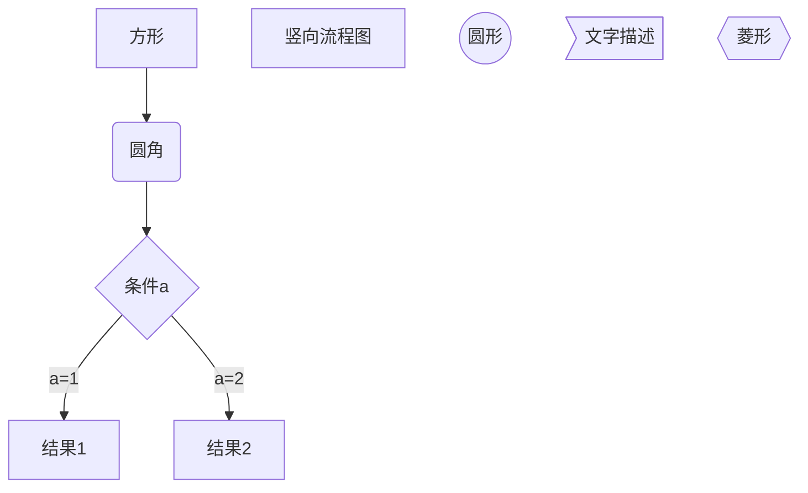
#### 	LR 横向 :

```
graph LR
A[方形] -->B(圆角)
    B --> C{条件a}
    C -->|a=1| D[结果1]
    C -->|a=2| E[结果2]
    F[横向流程图]
```


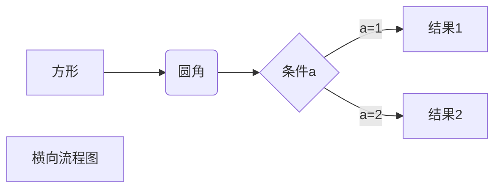

- 粗线条： **==>**
- 备注：A --> **|备注|** B
- 方形边框： **代号[名称]** （直接写名称默认是这个）
- 圆角边框： **代号(名称)**
- 菱形边框： **代号{名称}**

#### 例子：

```
graph TD;
	A(RUNNING) --> |"showdown()"| B(SHUTDOWN);
	B --> |"showdownNow()"| C(STOP);
	A --> |"showdownNow()"| C;
	B --> |"任务队列和线程池都清空后"| D(TIDYING);
	C --> |"任务队列清空后"| D;
	D --> |"terminated()结束后"| E(TERMINATED)
```


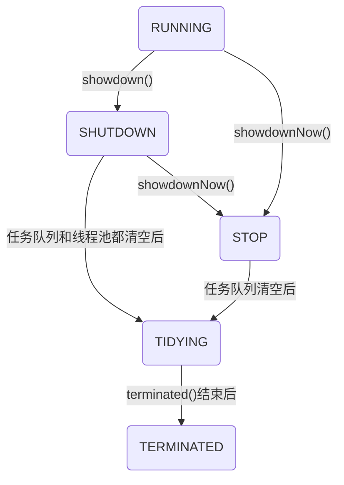
### 时序图

语法解释：`->>` 代表实线箭头，`-->>` 则代表虚线。

```
sequenceDiagram
	Alice->>John: Hello John,how are you?
	John -->> Alice:Great!
	Alice -> Te:haha
```

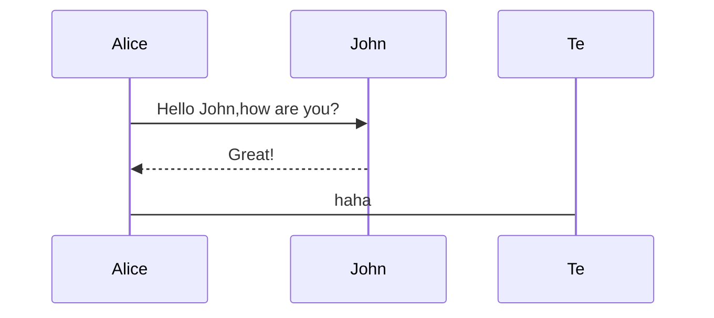
### UML-时序图

时序图例子,```->``` 直线，```-->```虚线，```->>```实线箭头

```
sequenceDiagram
participant 张三
participant 李四
张三->王五: 王五你好吗？
loop 健康检查
王五->王五: 与疾病战斗
end
Note right of 王五: 合理 食物 <br/>看医生...
李四-->>张三: 很好!
王五->李四: 你怎么样?
李四-->王五: 很好!
```
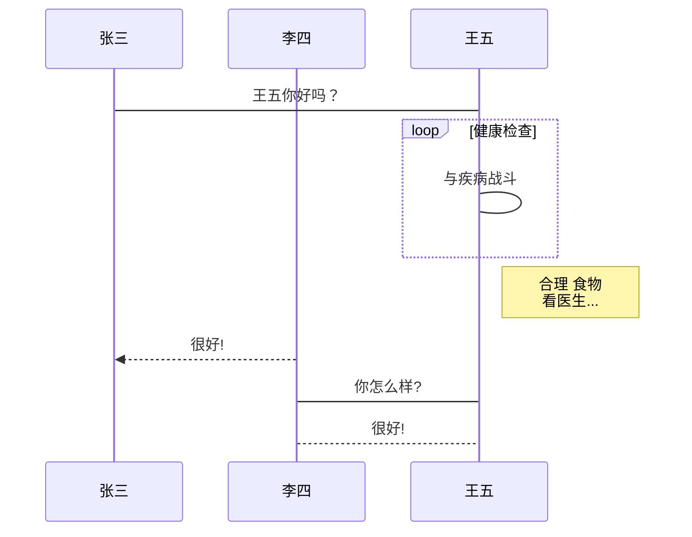

### **状态图**

语法解释：`[*]` 表示开始或者结束，如果在箭头右边则表示结束。

```text
stateDiagram
	[*] --> s1
	s1 --> [*]
	s1 --> s2
	s2 --> s1
	s2 --> [*]
```

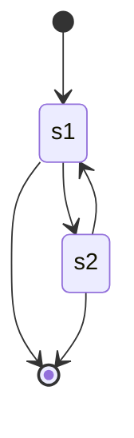

### **类图**

语法解释：`<|--` 表示继承，`+` 表示 `public`，`-` 表示 `private`，学过 Java 的应该都知道。

```text
classDiagram
      Animal <|-- Duck
      Animal <|-- Fish
      Animal <|-- Zebra
      Animal : +int age
      Animal : +String gender
      Animal: +isMammal()
      Animal: +mate()
      class Duck{
          +String beakColor
          +swim()
          +quack()
      }
      class Fish{
          -int sizeInFeet
          -canEat()
      }
      class Zebra{
          +bool is_wild
          +run()
      }
```

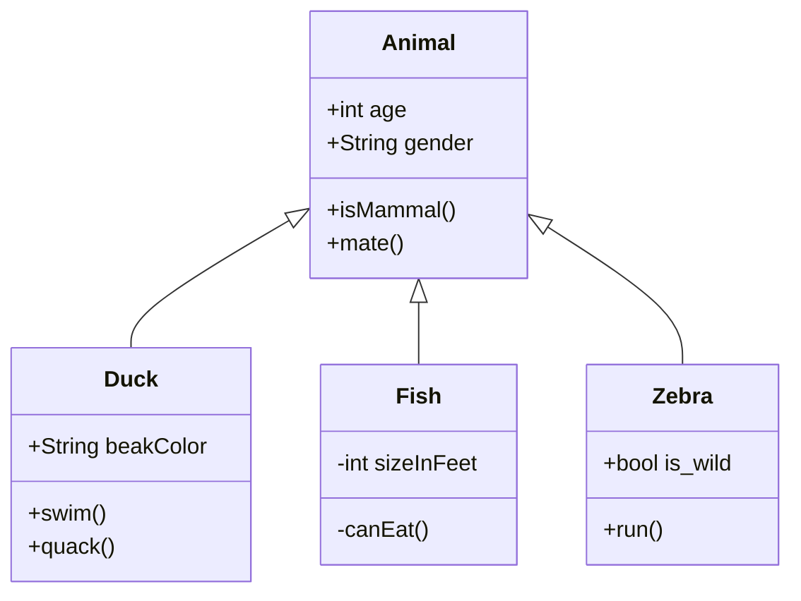


### **甘特图**

甘特图一般用来表示项目的计划排期，目前在工作中经常会用到。

语法也非常简单，从上到下依次是图片标题、日期格式、项目、项目细分的任务。

```text
gantt
    title 工作计划
    dateFormat  YYYY-MM-DD
    section Section
    A task           :a1, 2020-01-01, 30d
    Another task     :after a1  , 20d
    section Another
    Task in sec      :2020-01-12  , 12d
    another task      : 24d
```

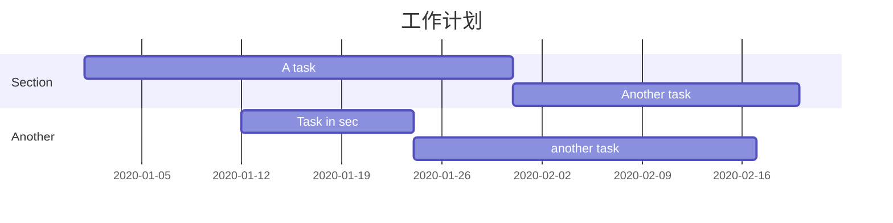

### **饼图**

饼图使用 `pie` 表示，标题下面分别是区域名称及其百分比。

```text
pie
    title Key elements in Product X
    "Calcium" : 42.96
    "Potassium" : 50.05
    "Magnesium" : 10.01
    "Iron" :  5
```

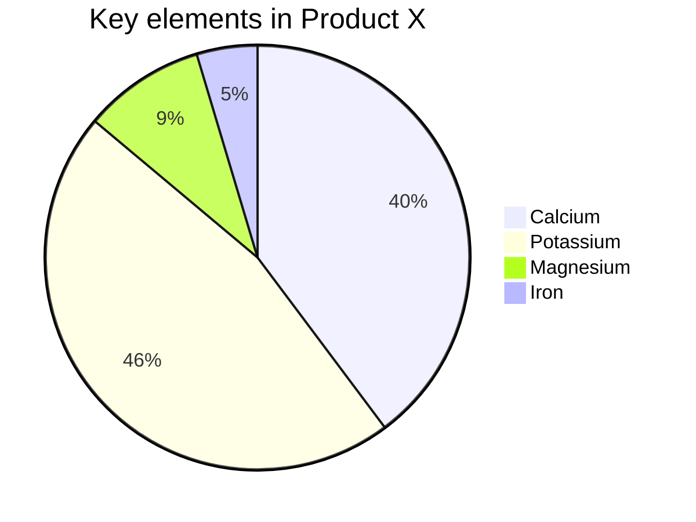

### 细节说明

#### **基本概念**

- TB - 从上到下
- BT - 从下到上
- RL - 从右到左
- LR - 从左到右
- TD - 从上到下

#### **节点和形状**

- strat 默认节点
- start[开始] 带有文本节点
- start(开始) 圆角节点
- start((开始) 圆形节点
- strat>开始] 非对称节点
- start{开始} 菱形节点

#### **节点之间连接**

- A-->B A指向B实线
- A---B A到B实线
- A--连接上文字---B
- A---|连接上文字|B
- A--连接上文字-->B
- A-->|连接上文字|B
- A-.->B 虚线
- A-.带文字的虚线.->B
- A==>B 粗线
- A==带文字的粗线==>B

#### **子图**

- subgraph one
- 节点-->
- 节点end

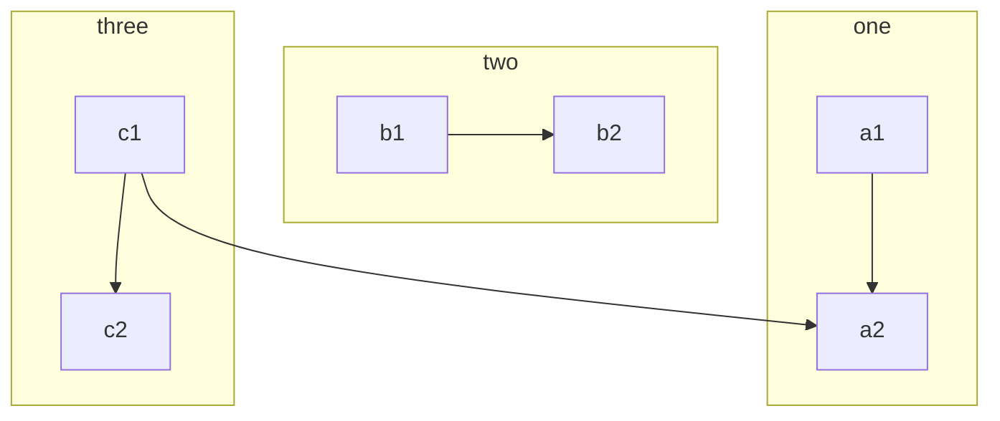

#### 序列图细节说明:

##### 参与者：

```
sequenceDiagram
participant 参与者1
participant 参与者2
```
...

##### 消息线：

- A --> B     A带箭头指向B

  A --- B      A不带箭头指向B

  A -.- B      A用虚线指向B

  A -.-> B    A用带箭头的虚线指向B

  A ==> B   A用加粗的箭头指向B

  A -- 描述 --- B       A不带箭头指向B并在中间加上文字描述

  A -- 描述 --> B      A带箭头指向B并在中间加上文字描述

  A -. 描述 .-> B      A用带箭头的虚线指向B并在中间加上文字描述

  A == 描述 ==> B  A用加粗的箭头指向B并在中间加上文字描述

###### 示例:

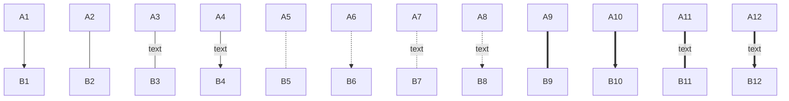

##### 标注：

```
Note right of 参与者:右边标注描述
Note left of 参与者:左边标注描述
Note over 参与者:在当中，可以横跨多个参与者
```
##### 循环：

```
loop 循环条件
循环体描述语句
end
```
##### 判断：

##### 分支语句

```
alt 条件 1 描述
分支 1 描述语句
else 条件 2 描述 # else 分支可选
分支 2 描述语句
else ...
...
end
```

##### 自定义样式

语法：style id 具体样式

###### 示例:

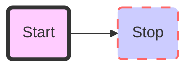

## 画图```flow```

输入\``` ```flow``` 然后回车，初始化一张空白图

### 流程图

#### 竖向:

```
flow
st=>start: 开始框
op=>operation: 处理框
cond=>condition: 判断框(是或否?)
sub1=>subroutine: 子流程
io=>inputoutput: 输入输出框
e=>end: 结束框
st->op->cond
cond(yes)->io->e
cond(no)->sub1(right)->op
```

```flow
flow
st=>start: 开始框
op=>operation: 处理框
cond=>condition: 判断框(是或否?)
sub1=>subroutine: 子流程
io=>inputoutput: 输入输出框
e=>end: 结束框
st->op->cond
cond(yes)->io->e
```

#### 横向:

```
flow
st=>start: 开始框
op=>operation: 处理框
cond=>condition: 判断框(是或否?)
sub1=>subroutine: 子流程
io=>inputoutput: 输入输出框
e=>end: 结束框
st(right)->op(right)->cond
cond(yes)->io(bottom)->e
cond(no)->sub1(right)->op
```

```flow
flow
st=>start: 开始框
op=>operation: 处理框
cond=>condition: 判断框(是或否?)
sub1=>subroutine: 子流程
io=>inputoutput: 输入输出框
e=>end: 结束框
st(right)->op(right)->cond
cond(yes)->io(bottom)->e
cond(no)->sub1(right)->op
```


## 画图```sequence```

输入\``` ```sequence``` 然后回车，初始化一张空白图

### UML时序图-简单

```
对象A->对象B: 对象B你好吗?（请求）
Note right of 对象B: 对象B的描述
Note left of 对象A: 对象A的描述(提示)
对象B-->对象A: 我很好(响应)
对象A->对象B: 你真的好吗？
```
```sequence
对象A->对象B: 对象B你好吗?（请求）
Note right of 对象B: 对象B的描述
Note left of 对象A: 对象A的描述(提示)
对象B-->对象A: 我很好(响应)
对象A->对象B: 你真的好吗？
```

### UML时序图-复杂

```
Title: 标题：复杂使用
对象A->对象B: 对象B你好吗?（请求）
Note right of 对象B: 对象B的描述
Note left of 对象A: 对象A的描述(提示)
对象B-->对象A: 我很好(响应)
对象B->小三: 你好吗
小三-->>对象A: 对象B找我了
对象A->对象B: 你真的好吗？
Note over 小三,对象B: 我们是朋友
participant C
Note right of C: 没人陪我玩
```

```sequence
Title: 标题：复杂使用
对象A->对象B: 对象B你好吗?（请求）
Note right of 对象B: 对象B的描述
Note left of 对象A: 对象A的描述(提示)
对象B-->对象A: 我很好(响应)
对象B->小三: 你好吗
小三-->>对象A: 对象B找我了
对象A->对象B: 你真的好吗？
Note over 小三,对象B: 我们是朋友
participant C
Note right of C: 没人陪我玩
```

